<!--
  GitHub Profile README — Purple Obsidian / Cosmos theme.
  Palette: void #05020a · nebula #c084fc · supernova #e879f9 · cosmic-ray #38bdf8 · text #e2e8f0
  EDIT the ✏️ social links below.
-->



<div align="center">


<p>
  
  
  
</p>

</div>

```text
 🔮 SYSTEM: ONLINE  │  PALETTE: PURPLE OBSIDIAN  │  ENGINE: GOLANG ⚡
```

---

### 🧾 Cosmic Operator Spec Sheet

```text
 🚀 ═══════════════════════════════════════════════════════════════ 🚀
                    COSMIC OPERATOR SPEC SHEET
 ─────────────────────────────────────────────────────────────────
   PRIMARY ENGINE ......... Go (Golang) · static loop-cost analysis
   TUI COCKPIT ............ Bubble Tea · Lip Gloss (terminal theater)
   AUTOMATION STACK ....... GitHub Actions · dynamic SVG · git notes
   DISTRIBUTION VECTOR .... GoReleaser · Homebrew · Docker
 ─────────────────────────────────────────────────────────────────
   MISSION DIRECTIVE ...... Zero-friction developer tools that fuse
                            hard engineering with cosmic flair.
 🪐 ═══════════════════════════════════════════════════════════════ 🪐
```

---

### 🛰️ Flagship — [`finops-guard`](https://github.com/srikalachallagundla32-cloud/finops-guard)

The CLI that turns cost governance into developer theater — catches unbatched LLM/Cloud API loops, renders a Doom-fire TUI with particle physics, and posts living cost cards on GitHub PRs.

```bash
brew install srikalachallagundla32-cloud/tap/finops-guard
```

<p align="center">
  <a href="https://github.com/srikalachallagundla32-cloud/finops-guard">
    
  </a>
</p>

---

### 🛠️ Stack

<p align="center">
  
  
  
  
  
</p>

---

### 📊 Live Telemetry

<p align="center">
  
  
</p>

<p align="center">
  
</p>

<p align="center">
  
</p>

---

### ⚡ Connect

<p align="center">
  <!-- ✏️ replace with your real handles -->
  <a href="https://linkedin.com/in/YOUR-HANDLE"></a>
  <a href="https://twitter.com/YOUR-HANDLE"></a>
  <a href="mailto:your.email@example.com"></a>
</p>

<p align="center">
  
</p>
