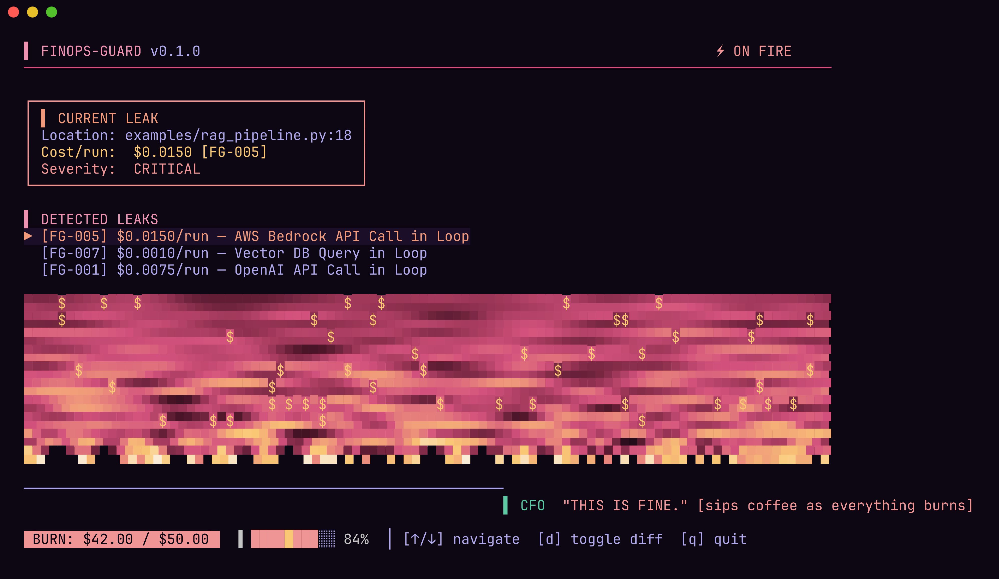

<!--
  GitHub Profile README — Srikala Challagundla
  Leads with FinOps-Guard: the profile is the product's landing page.
-->

<div align="center">

<!-- HERO: the first thing visitors see — the real FinOps-Guard TUI in action -->
<a href="https://github.com/srikalachallagundla32-cloud/finops-guard">
  
</a>

<br/>
<br/>

# Hi, I'm Srikala 👋

### I build developer tools that make invisible costs impossible to ignore.

<p>
  <a href="https://github.com/srikalachallagundla32-cloud/finops-guard">
    
  </a>
  <a href="https://github.com/srikalachallagundla32-cloud/homebrew-tap">
    
  </a>
  <a href="https://www.linkedin.com/in/srikala-challagundla/">
    
  </a>
</p>

</div>

---

## 🚀 Featured Project — FinOps Guard

**Shift-left cost protection for cloud & LLM API calls.** A static-analysis CLI that catches the loop-bound API calls — the "AI slop" — that quietly turn a $5 script into a $5,000 cloud bill. It scans your code *before merge* across **7 providers** (OpenAI, Anthropic, Bedrock, Vertex AI, Athena, DynamoDB, Pinecone), projects the dollar risk, and reports it right where you review: the pull request.

- 🔥 **Doom-fire Cost Reactor TUI** — a burn gauge sized to `projected / budget`, dollar-rain particles, and a rotating Virtual CFO.
- 📊 **Animated PR cost card** — posted on every pull request, with a one-click *Commit suggestion* to fix the flagged line.
- 🧾 **Git-notes spend ledger** — every merge stamped with a cost delta, so `git log` becomes an offline FinOps ledger.

```bash
# install
brew install srikalachallagundla32-cloud/tap/finops-guard
go install github.com/srikalachallagundla32-cloud/finops-guard/cmd/finops-guard@latest

# scan before you merge
finops-guard --pricing=pricing.json --scan=examples/rag_pipeline.py
```

<a href="https://github.com/srikalachallagundla32-cloud/finops-guard">
  
</a>

---

## 🧰 Toolbox

**Languages**

<p>
  
  
  
</p>

**Terminal UI**

<p>
  
  
</p>

**Ship & Automate**

<p>
  
  
  
  
  
</p>

---

## 🔭 Current Obsessions

- **Cost as a first-class code smell** — the same way linters flag unused vars, tools should flag the loop that's about to bankrupt you.
- **Developer theater** — CLIs that are genuinely fun to look at. If a tool makes you smile, you'll actually run it.
- **Zero-friction distribution** — `brew install` / `go install` and a green PR check. No dashboards, no signup, no runtime.
- **Static analysis without an AST tax** — how far scope-tracking + regex gets you before you *need* a full parser.

## 🛠️ Currently Building

- **FinOps Guard** → expanding detections toward a real AST pass (recursive-agent + unthrottled-poll patterns that regex can't reach).
- **The PR "theater" kit** → animated SVG cost cards, committable fix suggestions, and narrative check runs as a reusable Action.
- **A git-notes spend ledger** → turning `refs/notes/finops` into an offline, dashboard-free cost history.

---

## 📌 Projects

| Project | What it does | Stack |
|---------|--------------|-------|
| [**FinOps Guard**](https://github.com/srikalachallagundla32-cloud/finops-guard) | Catches loop-bound cloud/LLM API calls before they hit your bill · animated PR cost card · Doom-fire TUI | Go · Bubble Tea · GitHub Actions |
| [**homebrew-tap**](https://github.com/srikalachallagundla32-cloud/homebrew-tap) | One-line `brew install` distribution for my tools | Homebrew · GoReleaser |

---

## 📊 Activity

<p align="center">
  
</p>

<p align="center">
  
</p>

---

## 🤝 Connect

<p>
  <a href="https://www.linkedin.com/in/srikala-challagundla/">
    
  </a>
  <a href="mailto:srikalachallagundla32@gmail.com">
    
  </a>
</p>
